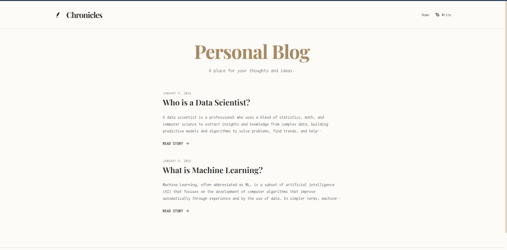
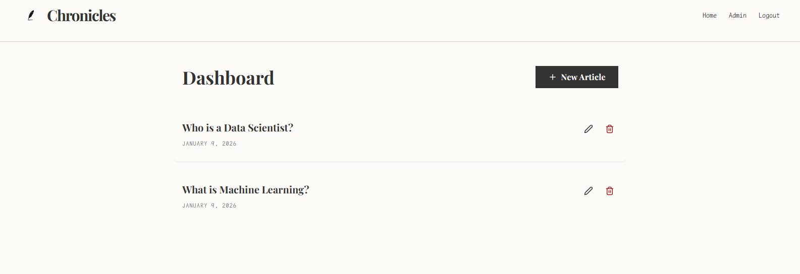

# Personal Blog

A modern, full-stack personal blog application built with **NestJS** (backend) and **React** (frontend). Features a beautiful vintage-themed UI with JWT authentication and admin functionality.


---

## 



## Tech Stack

### Backend

| Technology      | Purpose            |
| --------------- | ------------------ |
| NestJS          | Server framework   |
| TypeORM         | Database ORM       |
| PostgreSQL      | Database           |
| Passport JWT    | Authentication     |
| class-validator | Request validation |

### Frontend

| Technology   | Purpose             |
| ------------ | ------------------- |
| React 19     | UI framework        |
| Vite         | Build tool          |
| React Router | Client-side routing |
| Axios        | HTTP client         |
| Tailwind CSS | Styling             |
| Lucide React | Icons               |

---

## Project Structure

```
Personal-Blog-With-NestJS-or-React/
├── backend/                 # NestJS Backend
│   ├── src/
│   │   ├── articles/       # Articles module (CRUD)
│   │   ├── auth/           # Authentication module (JWT)
│   │   ├── app.module.ts   # Root module
│   │   ├── main.ts         # Entry point
│   │   └── ormconfig.ts    # Database configuration
│   ├── .env.example        # Environment template
│   └── package.json
│
├── frontend/                # React Frontend
│   ├── src/
│   │   ├── api/            # API client functions
│   │   ├── components/     # Reusable UI components
│   │   ├── context/        # React context providers
│   │   ├── pages/          # Page components
│   │   ├── types/          # TypeScript types
│   │   └── utils/          # Utility functions
│   └── package.json
│
└── README.md
```

---

## Getting Started

### Prerequisites

- **Node.js** (v18 or higher)
- **PostgreSQL** (v13 or higher)
- **npm** or **yarn**

### 1. Clone the Repository

```bash
git clone https://github.com/YOUR_USERNAME/Personal-Blog-With-NestJS-or-React.git
cd Personal-Blog-With-NestJS-or-React
```

### 2. Backend Setup

```bash
# Navigate to backend
cd backend

# Install dependencies
npm install

# Create .env file from template
cp .env.example .env

# Edit .env with your database credentials
# DB_USER=your_postgres_user
# DB_PASSWORD=your_postgres_password
# DB_NAME=your_database_name
# DB_PORT=5432

# Run in development mode
npm run start:dev
```

The backend will start at `http://localhost:3000`

### 3. Frontend Setup

```bash
# Navigate to frontend (from project root)
cd frontend

# Install dependencies
npm install

# Run in development mode
npm run dev
```

The frontend will start at `http://localhost:5173`

---

## Environment Variables

Create a `.env` file in the `backend` directory:

```env
# Admin Credentials
ADMIN_EMAIL=admin@blog.com
ADMIN_PASSWORD_HASH=$2b$10$kZsrqysthCzL.Q4w3lAYiuVIaInKvtEsaby9gfgj2uYQBxmkadHt2

# JWT Configuration
JWT_SECRET=your-super-secret-key
JWT_EXPIRES_IN=3600s

# Database Configuration
DB_USER=your_db_user
DB_PASSWORD=your_db_password
DB_NAME=your_db_name
DB_PORT=5432
```

**Note:** The default admin password hash corresponds to password `admin123`. Generate a new hash for production!

---

## API Endpoints

### Authentication

| Method | Endpoint      | Description            | Auth |
| ------ | ------------- | ---------------------- | ---- |
| POST   | `/auth/login` | Login with credentials | ❌   |

### Articles

| Method | Endpoint        | Description        | Auth     |
| ------ | --------------- | ------------------ | -------- |
| GET    | `/articles`     | Get all articles   | ❌       |
| GET    | `/articles/:id` | Get single article | ❌       |
| POST   | `/articles`     | Create article     | ✅ Admin |
| PATCH  | `/articles/:id` | Update article     | ✅ Admin |
| DELETE | `/articles/:id` | Delete article     | ✅ Admin |

---

## Available Scripts

### Backend

```bash
npm run start:dev    # Start dev server with hot reload
npm run build        # Build for production
npm run start:prod   # Start production server
npm run test         # Run unit tests
npm run lint         # Lint code
```

### Frontend

```bash
npm run dev          # Start dev server
npm run build        # Build for production
npm run preview      # Preview production build
npm run lint         # Lint code
```

---

## Deployment

### Frontend (Vercel/Netlify)

1. Build the frontend:
   ```bash
   cd frontend
   npm run build
   ```
2. Deploy the `dist` folder to your preferred platform

### Backend (Railway/Render/Heroku)

1. Set environment variables on your hosting platform
2. Deploy with:
   ```bash
   cd backend
   npm run build
   npm run start:prod
   ```

---

Author: Eman
GitHub: [@emanalytic](https://github.com/emanalytic)
